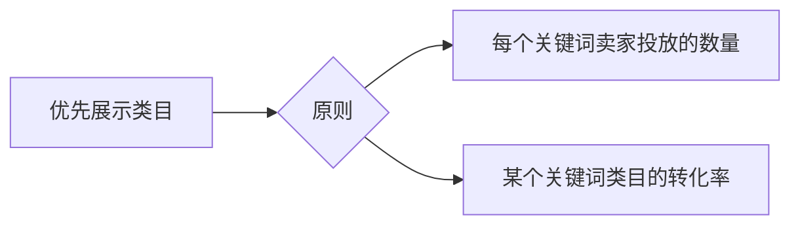

# 1. 免费引流
## 1.1 淘宝、天猫引流必懂的词
> **PV:** `Page view (访问量)` ，表示页面浏览量或点击量，用户每刷新一次即计算一次。
> **UV:** `Unique Visitor (独立访客)`，访问网店的一台电脑为一访客，每天一台电脑只记一次。一个IP从多个客户端进行访问，每个客户端算一个 UV。
> **SKU:**`Stock Keeping Unit(库存量单位)`，表示每个产品的属性，即颜色、尺码等信息。如**女秋冬短裤**商品，深黑色 S 码是一个 SKU, 米色 L 码又是一个 SKU。
> **IPV:** 商品详情页访问量，买家找到店铺宝贝后，进入详情页的次数。
> **KA:** `Key Account(关键客户)`。
> **SEO:** 即`Search Engine Optimzation(搜索引擎优化)`，自然搜索。
> 淘宝SEO分两种：
> 1. 站外搜索
> 2. 站内搜索
## 1.2 免费流量的三大入口
### 1.2.1 搜索流量入口
- 淘宝上的搜索
### 1.2.2 类目流量入口
- 类目浏览指点击**淘宝首页类目**入口进入店铺的流量。
### 1.2.3 专题流量入口
- 指平台的活动，由此获得店铺的流量 (某些活动需要信誉度)。
## 1.3 淘宝、天猫怎么获取免费流量
### 1.3.1 主营类目优化
#### 淘宝优先展示类目的原则：

