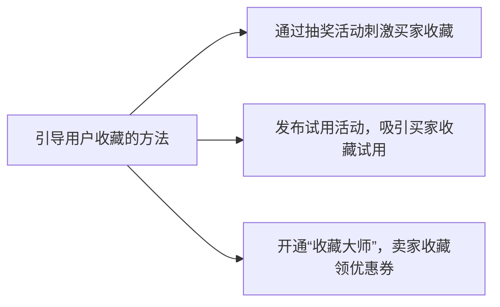
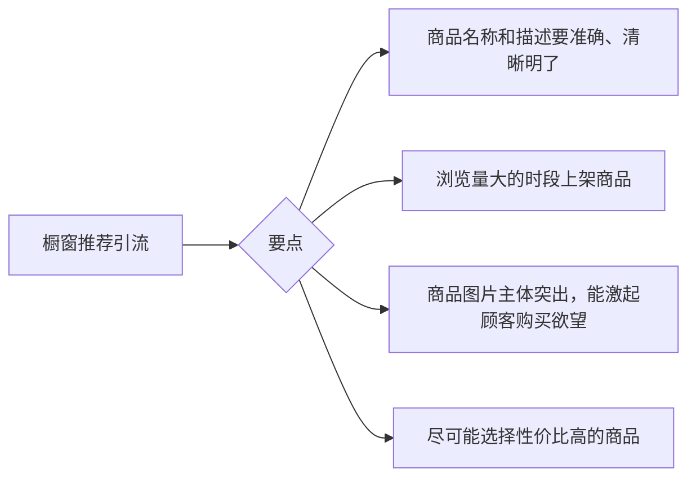

# 1. 免费引流
## 1.1 淘宝、天猫引流必懂的词
> **PV:** `Page view (访问量)` ，表示页面浏览量或点击量，用户每刷新一次即计算一次。
> **UV:** `Unique Visitor (独立访客)`，访问网店的一台电脑为一访客，每天一台电脑只记一次。一个IP从多个客户端进行访问，每个客户端算一个 UV。
> **SKU:**`Stock Keeping Unit(库存量单位)`，表示每个产品的属性，即颜色、尺码等信息。如**女秋冬短裤**商品，深黑色 S 码是一个 SKU, 米色 L 码又是一个 SKU。
> **IPV:** 商品详情页访问量，买家找到店铺宝贝后，进入详情页的次数。
> **KA:** `Key Account(关键客户)`。
> **SEO:** 即`Search Engine Optimzation(搜索引擎优化)`，自然搜索。
> 淘宝SEO分两种：
> 1. 站外搜索
> 2. 站内搜索
## 1.2 免费流量的三大入口
### 1.2.1 搜索流量入口
- 淘宝上的搜索
### 1.2.2 类目流量入口
- 类目浏览指点击**淘宝首页类目**入口进入店铺的流量。
### 1.2.3 专题流量入口
- 指平台的活动，由此获得店铺的流量 (某些活动需要信誉度)。
## 1.3 淘宝、天猫怎么获取免费流量
### 1.3.1 主营类目优化
#### 淘宝优先展示类目的原则：

### 1.3.2 店铺类型优化

**个人店铺** < **天猫店铺**  < **企业店铺**
### 1.3.3 宝贝属性优化
除了设置品牌、适用对象、主材质等商品属性外，还可以设置 **数量** 、**适用节日** 、**产地** 、 **分类** 等筛选条件

### 1.3.4 标题关键词优化
 - 添加一些热度高和匹配度高的关键词，从而让商品获得更多的曝光量，吸引更多用户点击。
### 1.3.5 打造新品标签
- 淘宝对芯片的定义是全新的产品，可以从3个角度去考虑：标题、图片和产品属性。获得了 “新品” 标签的商品可以增加 **搜索权重** ，得到更好的搜索排名。
1. 标题
> 	写标题时测试标题的唯一性。如：一般服装嘞标题组成形式为: `品牌 + 营销词 + 核心关键词 + 宝贝风格 + 宝贝卖点(或者热搜属性) + 类目词`。写好之后可以把标题复制到淘宝搜索栏看看有没有相同的标题，如果有，继续修改。直到找不到相同标题即可。
2. 图片
> 图片的唯一性可以从两个方面入手。
>  -  改变图片的色块值。网页上的图片都是RGB模式，如抠图、更换图片背景、改变图片角度、改变图片大小、改变图片格式、利用图层叠加等，改变图片色块值。
>  - 删除图片属性信息。拍摄的原始照片上会保留图片信息，可以利用 **光影魔术手、可牛** 等图片处理软件打开图片，保存时选中 “删除EXIF信息”复选框。
3. 产品属性
> 产品属性注意货号不要跟其他产品的重复。

### 1.3.6 引导用户收藏
- 收藏高德店铺或商品会获得优先展示的机会。

### 1.3.7 引导用户加购
“加购”是指买家把商品加入购入车，
### 1.3.8 引导用户好评
好评率不但对卖家的成交率有直接的影响，还会对店铺流量产生影响。
引导好评可以从三点入手。
1. 展示老客户评价：在宝贝评价等页面，引导买家从众心理，让他们给出类似好评。
2. 好评活动：当买家收货时，可以通过短信、电话、小卡片及微信等渠道，提醒买家参与评价活动，如 “写好评赢大奖” 等。
3. 温馨的客户关怀提示：在买家等待收获的这段时间内，通过短信或电话形势告知相应的发货和物流信息，顺便提醒买家收货时给予好评。
### 1.3.9 参加免费试用
淘宝的官方活动名称：`阿里试用` 
### 1.3.10 橱窗推荐引流
- 淘宝橱窗类似实体店的展货架，可以摆放一些商品，吸引顾客进入店铺。

### 1.3.11 微淘引流
### 1.3.12 千牛引流
- 千牛主要功能包含商品管理、交易管理、评价管理、数据运营、促销管理、采购管理、客服管理、客户运营、企业协同、金融服务、仓储物流、短视频推广等。
### 1.3.13 聚划算引流
- 聚划算是一个展现买家服务端互联网团购平台，商品团、品牌团。
- 不仅可以为商家店铺和商品带来丰富的真实流量。
### 1.3.14 天天特价引流
- 扶持中小卖家的官方活动，通过卖家中心找到“天天特价”的报名入口。
### 1.3.15 阿里旺旺引流
### 1.3.16 淘口令引流
## 1.4 利用站外渠道引流
